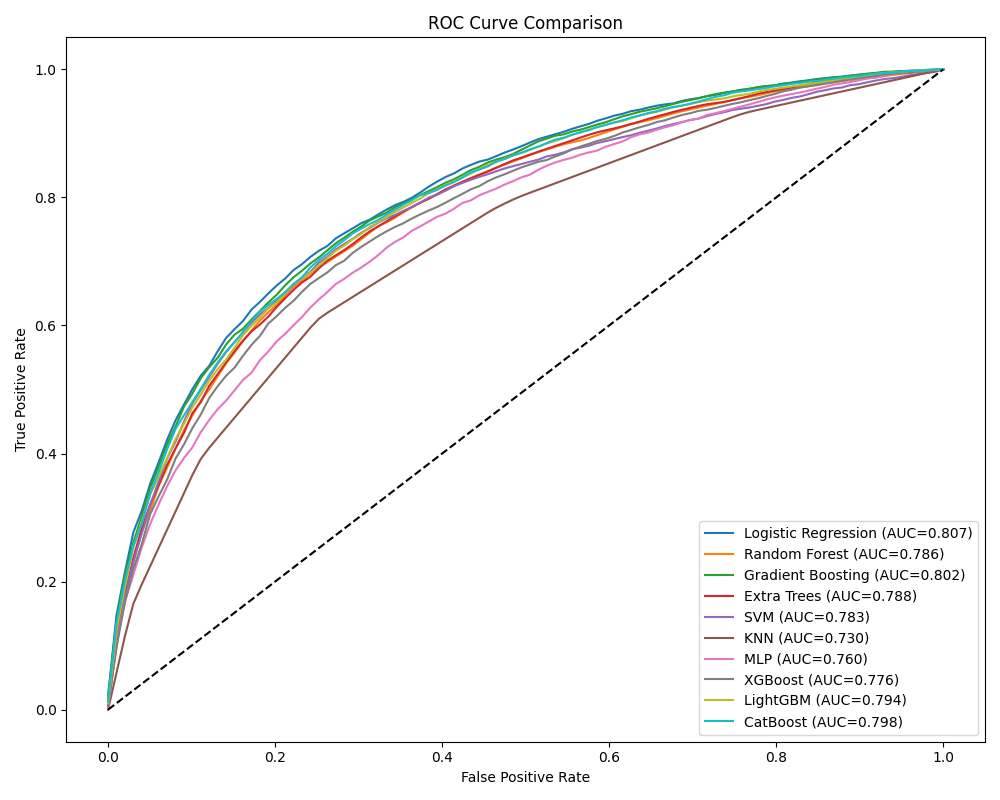
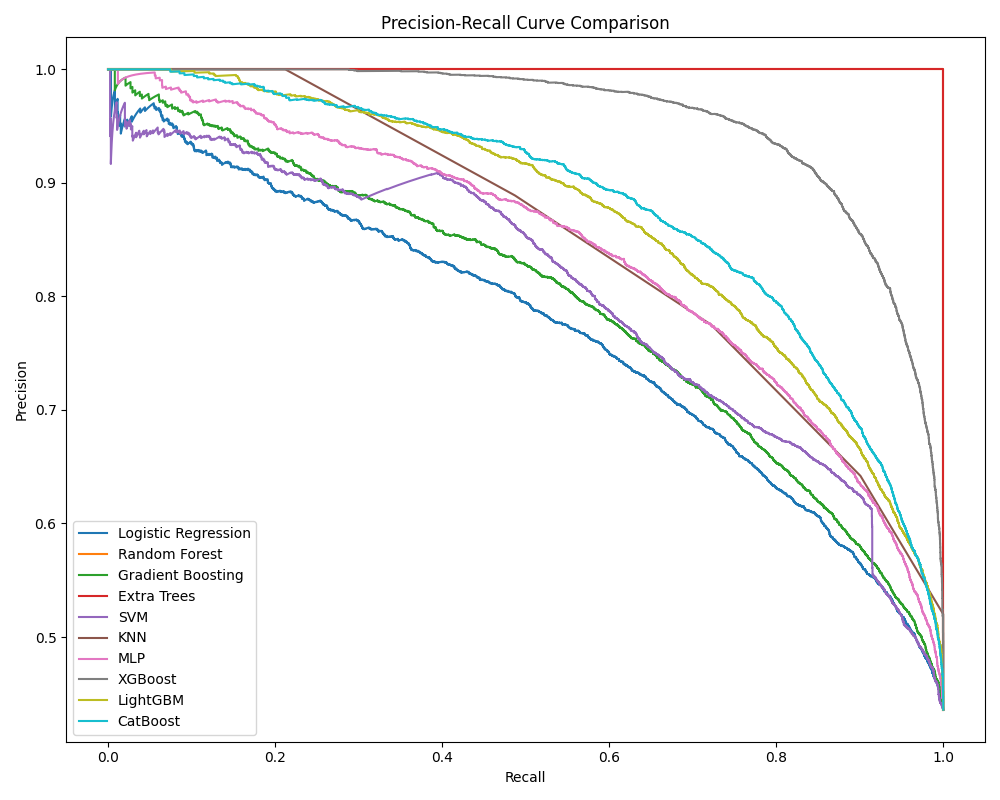
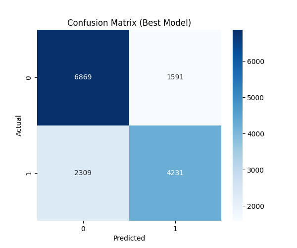
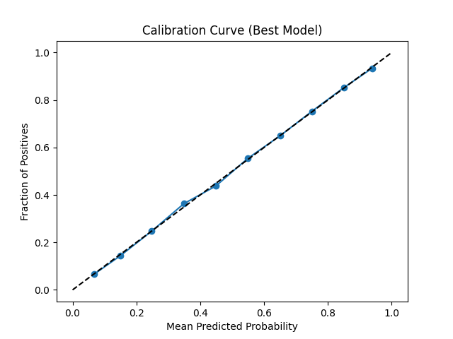
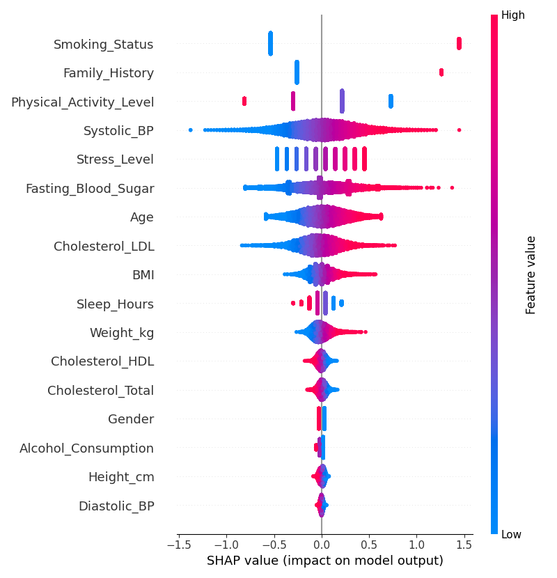

**Cardiovascular Disease Risk Prediction using Machine Learning
Overview**

This project implements a comprehensive Machine Learning system to predict cardiovascular disease risk using a synthetic healthcare dataset containing 19 clinical features. The system trains multiple ML models, evaluates them using ROC-AUC and F1-score, selects the best performing model automatically, generates analytical visualizations, and provides a local desktop UI for prediction. The entire project runs locally in Python and is compatible with PyCharm.

**Models Implemented**

The following models are trained and evaluated: Logistic Regression, Random Forest, Gradient Boosting, Extra Trees, Support Vector Machine (SVM), K-Nearest Neighbors (KNN), Multi-Layer Perceptron (Neural Network), XGBoost, LightGBM, and CatBoost. A soft-voting ensemble model is also created using top-performing compatible models.

**Evaluation & Analysis**

The project includes ROC Curve comparison, Precision-Recall Curve comparison, Confusion Matrix heatmap (best model), Calibration Curve, Threshold Optimization (best F1 threshold), Feature Importance heatmap, and SHAP explainability for model interpretation. Model selection is primarily based on cross-validated ROC-AUC and F1-score.

**Desktop Application**

A Tkinter-based local desktop interface allows users to select a prediction model (Best / Ensemble / Individual models), enter patient clinical data, generate cardiovascular risk probability, view confusion matrix, and visualize risk probability via a gauge-style display.

**Project Structure**

Cardio-Vascular-Disease-Predictor/
dataset.csv
model_selector.py
predictor.py
ui_app.py
README.md

**Installation**

Create a virtual environment (recommended):
python -m venv venv

Activate it (Windows):
venv\Scripts\activate

Install required packages:
pip install pandas numpy matplotlib seaborn scikit-learn xgboost lightgbm catboost shap joblib

**How to Run**

Step 1 – Train models:
python model_selector.py
This trains all models, generates evaluation graphs, and saves trained models and preprocessing artifacts.

Step 2 – Launch UI:
python ui_app.py
Enter patient details and select a model to predict cardiovascular disease risk.

**Technologies Used**

Python, scikit-learn, XGBoost, LightGBM, CatBoost, SHAP, Tkinter, Matplotlib, Seaborn, NumPy, Pandas.

**Key Highlights**

Multi-model comparison framework, cross-validation-based evaluation, explainable AI integration (SHAP), automated threshold optimization, and local desktop deployment.

**Graphs**
### ROC Curve Comparison

### Precision–Recall Curve

### Confusion Matrix

### Calibration Curve

### Feature Importance Heatmap

**Author**

Aditya Kumar Barik
